# Chapter 1 - Introduction

This series of articles is a deep dive into State Management, different approaches, their upsides and downsides, as well as providing justification for the design choices of the `pods` package for dart.

> Disclaimer: this is mostly an experiment. I let my thoughts run wild, come up with ideas based on things that I have found to work or not work in my own experience building Flutter apps and using a number of state management approaches and libraries.

## Should state be linked to UI?
Take a loot at the diagram below:

There is no overlap between the "State Machine" and the UI. The UI throws events at the state machine, and gets all of it's data from there. It must be noted that though this is a very simple diagram, it does cover all code in the whole system, both frontend and backend. Yup, the whole server resides in the state machine. This diagram avoids most of the difficulty of state management, but just shows the separation between state and UI. How to design this state machine will be delt with in the next chapters.
## Types of state
This is a good time to make an important distinction between UI state and other state. UI state is basically state that is widget bound. It never leaves the scope of a single widget, it is never persistent, it does not interact with the state machine, and any widgets `A` stores that piece of state independent of the others. If any piece of state fits all those categories, it should not be part of the state machine, but should instead be stored inside of the widget, for example using a stateful widget.

Therefore our diagram could be updated to add a small bit of UI state that is in direct contact with the UI. Management of this state is done inside of the widget lifetime. Mutations are done inside the widget. This is really not that difficult to get this right, thus, we will not be looking much at UI state from this point on.

It is this distinction that is part of the motivation for the existence of the state machine in the first place. There are some pieces of state that are clearly widget bound, like a collapsible widget being open or closed, or the scroll position, or the tab-index. There are other types of state, for example settings, network request results, etc. that are completely separate from UI state and only touch on screen.

For this reason it is foolish to try to make this type of state go through the widget tree, even if a nice-to-use library is used to make this process simpler. This state is inherently global, right? Server state is global, right? The main goal of the client part of the state machine is to handle caching, interactions with local state, etc. Don't try to make your beautiful state logic fit into the shape that your UI should look. Trying to make your state flow match the widget tree is just an unnecessary restriction that can come to bite you when it doesn't perfectly fit.

In [the next chapter](chapter_2_reactivity) we will look at Reactivity.
